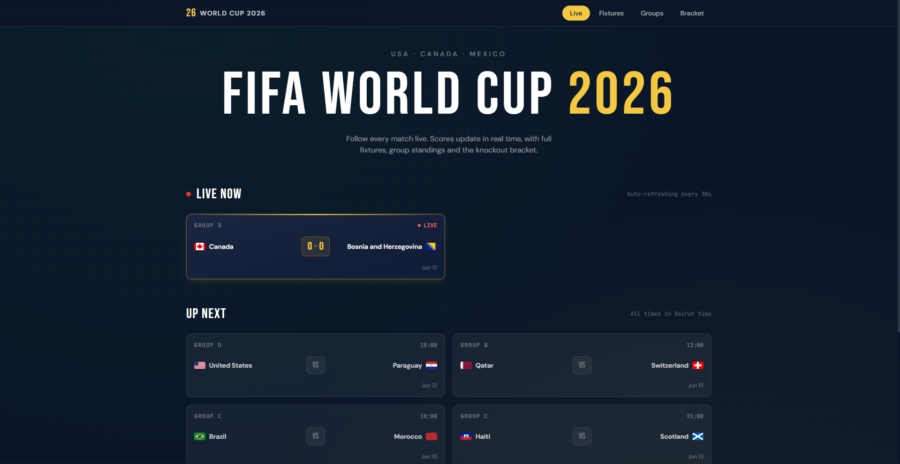
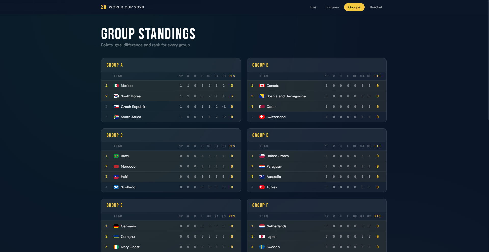
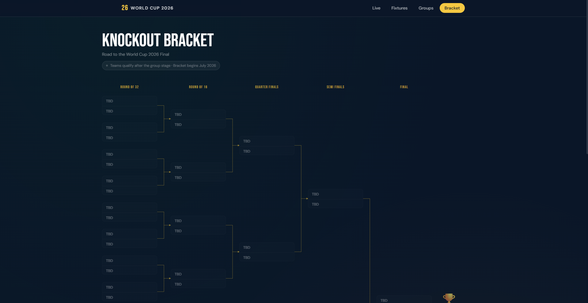

# 🏆 World Cup 2026 Tracker

<div align="center">


**Follow every match of the FIFA World Cup 2026 in real time.**
Live scores · Group standings · Knockout bracket

</div>

---

## 📸 Screenshots

| Home — Live & Upcoming | Group Standings | Knockout Bracket |
|---|---|---|
|  |  |  |

---

## ✨ Features

- ⚡ **Live scores** — auto-polling every 10 seconds during active matches, 30 seconds otherwise
- 📊 **Group standings** — all groups sorted by points → goal difference → goals scored, with GF / GA columns
- 🏅 **Best 8 third-place** qualification highlight across all groups
- 🗓 **Fixtures page** — all group stage matches grouped by Lebanon date, with live/upcoming/finished sections
- 🏆 **Knockout bracket** — visual SVG bracket with connector lines, desktop scroll + mobile stacked view
- 🌍 **Lebanon timezone** — all times displayed in Asia/Beirut (EEST, UTC+3)
- 📱 **Fully responsive** — mobile-first design with a desktop bracket view
- 🎨 **Dark premium UI** — gold accent design system with smooth animations

---

## 🗂 Project Structure

```
WORLDCUP2026-frontend/
├── app/
│   ├── page.jsx                  # Home — live & upcoming matches
│   ├── fixtures/
│   │   └── page.jsx              # All group stage fixtures
│   ├── standings/
│   │   └── page.jsx              # Group standings table
│   └── bracket/
│       └── page.jsx              # Knockout bracket
├── components/
│   ├── Navbar/page.jsx           # Sticky top nav
│   └── MatchCard/page.jsx        # Reusable match card
├── hooks/
│   └── usePolling.js             # Auto-refresh with live/idle intervals
├── lib/
│   ├── api.js                    # API fetch helpers
│   └── teams.js                  # Team map helper
└── public/
```

---

## 📡 Data & API

| Endpoint | Description |
|---|---|
| `GET /get/games` | All matches (group stage + knockout) |
| `GET /get/teams` | Team info including flags |
| `GET /get/groups` | Group standings data |

Match statuses are derived client-side:

| `finished` field | `time_elapsed` | Derived status |
|---|---|---|
| `"TRUE"` | any | `finished` |
| `"FALSE"` | `"notstarted"` | `upcoming` |
| `"FALSE"` | anything else | `live` |

---

## 🏗 Tech Stack

| Layer | Technology |
|---|---|
| Framework | [Next.js 16](https://nextjs.org) (App Router) |
| UI | [React 19](https://react.dev) |
| Styling | [Tailwind CSS v3](https://tailwindcss.com) |
| Data Source | [worldcup26.ir](https://worldcup26.ir) REST API |
| Fonts | Custom display + body font via `globals.css` |
| Deployment | [Vercel](https://vercel.com) |

---

## 📄 License

Distributed under the MIT License. See `LICENSE` for more information.

---

## 🙏 Acknowledgements

- Match data provided by [worldcup26.ir](https://worldcup26.ir)
- Built with [Next.js](https://nextjs.org) and [Tailwind CSS](https://tailwindcss.com)

---

<div align="center">
  <sub>FIFA World Cup 2026 · USA · Canada · Mexico</sub>
</div>
